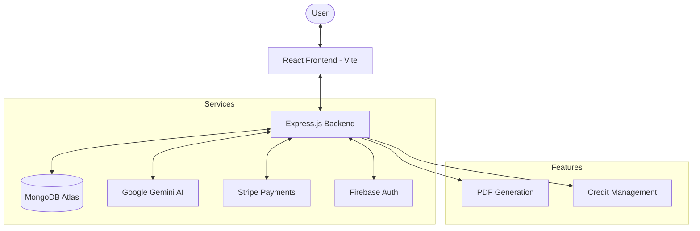

# 🎓 ExamNotes AI - Your Ultimate AI Study Companion

For automated scoring validation, test execution scripts, and Gen AI alignment details, please refer to our comprehensive PRD.md.


ExamNotes AI is a premium, AI-driven learning platform designed to transform the way students prepare for exams. By leveraging the power of Google's Gemini AI, it generates structured notes, flashcards, study roadmaps, and visual charts from any topic in seconds.

---

## ✨ Key Features

- 🧠 **AI-Powered Note Generation:** Instantly generate detailed notes using advanced AI models (Gemini).
- 🗺️ **Study Roadmaps:** Get a step-by-step guide to mastering any subject.
- 🗂️ **Smart Flashcards:** 3D flippable flashcards for efficient active recall.
- 📊 **Visual Charts:** Integrated Mermaid.js support for generating diagrams and flowcharts.
- 📄 **PDF Export:** Download your generated notes as professionally formatted PDFs.
- 💳 **Credit System:** Seamless Stripe integration for a premium subscription model.
- 🔐 **Secure Auth:** Multi-layered authentication using Firebase and JWT.
- 📱 **Responsive Dashboard:** A sleek, glassmorphic UI designed for all devices.

---

## 🛠️ Tech Stack

### Frontend

- **Framework:** React 19 (Vite)
- **State Management:** Redux Toolkit
- **Styling:** Tailwind CSS 4.0
- **Animations:** Motion (Framer Motion)
- **Charts:** Recharts & Mermaid.js
- **Icons:** React Icons

### Backend

- **Runtime:** Node.js
- **Framework:** Express.js
- **Database:** MongoDB (Mongoose)
- **AI Integration:** Google Generative AI (Gemini SDK)
- **Payments:** Stripe API
- **Authentication:** Firebase Admin & JSON Web Tokens (JWT)
- **PDF Generation:** PDFKit

---

## 🏗️ System Architecture



---

## 🚀 Getting Started

### Prerequisites

- Node.js (v18+)
- MongoDB Atlas Account
- Firebase Project
- Google Gemini API Key
- Stripe Account (for payments)

### Installation

1. **Clone the repository:**

   ```bash
   git clone https://github.com/krishnaaahhhhhh/ExamNotesAI.git
   cd ExamNotesAI
   ```

2. **Setup Server:**

   ```bash
   cd server
   npm install
   ```

   Create a `.env` file in the `server` directory:

   ```env
   PORT=5008
   MONGO_URI=your_mongodb_uri
   JWT_SECRET=your_jwt_secret
   GEMINI_API_KEY=your_gemini_key
   STRIPE_SECRET_KEY=your_stripe_key
   STRIPE_WEBHOOK_SECRET=your_webhook_secret
   CLIENT_URL=http://localhost:5173
   ```

3. **Setup Client:**
   ```bash
   cd ../client
   npm install
   ```
   Create a `.env` file in the `client` directory:
   ```env
   VITE_FIREBASE_API_KEY=your_firebase_key
   VITE_BACKEND_URL=http://localhost:5008
   ```

### Running Locally

- **Start Server:** `npm start` or `nodemon index.js` (inside /server)
- **Start Client:** `npm run dev` (inside /client)

---

## 📸 Project Structure

```text
ExamNotesAi/
├── client/                # React (Vite) Frontend
│   ├── src/
│   │   ├── components/    # Reusable UI components
│   │   ├── pages/         # Page layouts
│   │   ├── services/      # API integration
│   │   └── store/         # Redux logic
├── server/                # Express Backend
│   ├── controllers/       # Business logic
│   ├── models/            # Mongoose schemas
│   ├── routes/            # API endpoints
│   ├── services/          # External API handlers (Gemini, Stripe)
│   └── utils/             # Helper functions
```

---

## 🌐 Deployment

The project is optimized for deployment on **Vercel** (Frontend) and **Render/Railway** (Backend). Use the provided `vercel.json` and `nodemon.json` configurations for seamless deployment.

---

## 📜 License

This project is licensed under the ISC License.

Developed with ❤️ by the ExamNotes AI Team.
